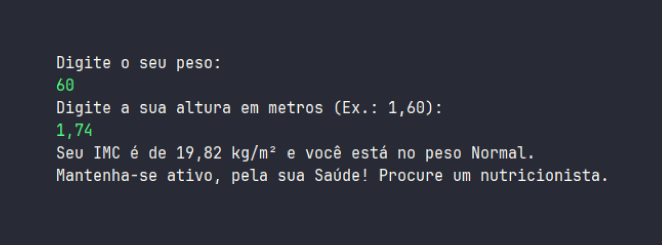

# Calculadora de IMC em Java


[](https://opensource.org/licenses/MIT)
[](https://www.java.com/)


<div align="center">

<br><br>

</div><br><br>


Este repositório contém uma implementação de uma calculadora de Índice de Massa Corporal (IMC) desenvolvida em Java. O IMC é uma medida que avalia a relação entre a massa corporal e a altura de uma pessoa, sendo uma ferramenta amplamente utilizada para avaliar a saúde e o peso corporal.

A calculadora de IMC aqui apresentada oferece uma interface de linha de comando fácil de usar, permitindo que os usuários insiram seu peso e altura para calcular seu IMC. Além disso, a aplicação classifica o IMC resultante em categorias como abaixo do peso, peso normal, sobrepeso e obesidade, fornecendo uma visão geral do estado atual de saúde com base nessas classificações padrão.

<br> <div align="center">



</div> <br>

## Funcionalidades

- Calcula o IMC com base no peso e altura inseridos pelo usuário.
- Classifica o IMC em categorias: abaixo do peso, peso normal, sobrepeso, obesidade.
- Interface de linha de comando simples e fácil de usar.

## Como usar

1. Certifique-se de ter o Java instalado em seu sistema. Você pode verificar digitando o seguinte comando no terminal:

    ```bash
    java -version
    ```

2. Clone este repositório para o seu computador:

    ```bash
    git clone https://github.com/seu-usuario/calculadora-imc-java.git
    ```

3. Navegue até o diretório do projeto:

    ```bash
    cd calculadora-imc-java
    ```

4. Compile o código-fonte:

    ```bash
    javac IMCCalculator.java
    ```

5. Execute a aplicação:

    ```bash
    java IMCCalculator
    ```

6. Siga as instruções na tela para inserir seu peso e altura e obter o resultado do IMC.

## Contribuindo

Contribuições são bem-vindas! Se você tiver sugestões de melhorias, novas funcionalidades ou encontrar algum problema, sinta-se à vontade para abrir uma issue ou enviar um pull request.

## Licença

Este projeto está licenciado sob a [MIT License](LICENSE).
